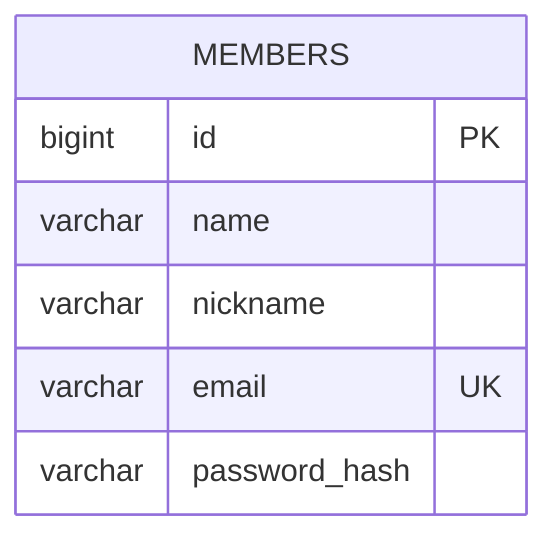

# 현재 데이터 모델

> 상태: 일부 구현

현재 회원가입 기능을 위해 `members` 테이블을 구현했습니다. 건강활동 데이터 테이블과 일·월 집계 테이블은 아직 구현하지 않았습니다.

## members

| 컬럼 | 타입 | 제약조건 | 설명 |
| --- | --- | --- | --- |
| `id` | `BIGINT` | PK, 자동 생성 | 내부 회원 식별자 |
| `name` | `VARCHAR(100)` | NOT NULL | 회원 이름 |
| `nickname` | `VARCHAR(30)` | NOT NULL | 서비스 표시 이름 |
| `email` | `VARCHAR(254)` | NOT NULL, UNIQUE (`uk_members_email`) | 로그인 식별자 |
| `password_hash` | `VARCHAR(60)` | NOT NULL | BCrypt 해시 |

이메일 유니크 제약조건은 애플리케이션의 사전 중복 검사와 별개로 동시 요청의 중복 저장을 막습니다. 실제 MySQL 호환성 테스트로 `uk_members_email` 제약조건 예외 형식도 검증합니다.

## 미구현 범위

- 건강활동 원본 이벤트와 `recordkey` 연결 모델
- 일별·월별 활동 집계 모델
- 회원과 건강활동 데이터의 관계

건강활동 기능을 구현할 때 실제 입력 데이터의 시간대·수치 표현·중복 식별 정책을 확정한 뒤 이 문서를 확장합니다.
