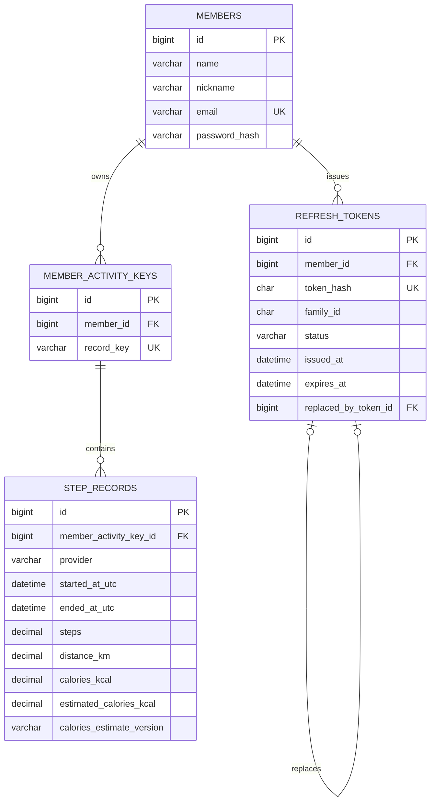

# 현재 데이터 모델

> 상태: 구현 완료

회원·인증 토큰·걸음수 원본 이벤트를 위한 `members`, `refresh_tokens`, `member_activity_keys`, `step_records` 테이블을 구현했습니다. 일·월 집계 테이블은 원본 이벤트 직접 집계 방침에 따라 만들지 않습니다.

## members

| 컬럼 | 타입 | 제약조건 | 설명 |
| --- | --- | --- | --- |
| `id` | `BIGINT` | PK, 자동 생성 | 내부 회원 식별자 |
| `name` | `VARCHAR(100)` | NOT NULL | 회원 이름 |
| `nickname` | `VARCHAR(30)` | NOT NULL | 서비스 표시 이름 |
| `email` | `VARCHAR(254)` | NOT NULL, UNIQUE (`uk_members_email`) | 로그인 식별자 |
| `password_hash` | `VARCHAR(60)` | NOT NULL | BCrypt 해시 |

이메일 유니크 제약조건은 애플리케이션의 사전 중복 검사와 별개로 동시 요청의 중복 저장을 막습니다. 실제 MySQL 호환성 테스트로 `uk_members_email` 제약조건 예외 형식도 검증합니다.

## refresh_tokens

| 컬럼 | 타입 | 제약조건 | 설명 |
| --- | --- | --- | --- |
| `id` | `BIGINT` | PK, 자동 생성 | 내부 토큰 식별자 |
| `member_id` | `BIGINT` | NOT NULL, FK | 토큰 소유 회원 |
| `token_hash` | `CHAR(64)` | NOT NULL, UNIQUE (`uk_refresh_tokens_token_hash`) | Refresh Token의 SHA-256 해시 |
| `family_id` | `CHAR(36)` | NOT NULL | 로그인·회전으로 이어지는 토큰 계열 식별자 |
| `status` | `VARCHAR(10)` | NOT NULL | `ACTIVE`, `ROTATED`, `REVOKED` 상태 |
| `issued_at` | `DATETIME(6)` | NOT NULL | 발급·회전 시각 |
| `expires_at` | `DATETIME(6)` | NOT NULL | 발급·회전 시점부터 14일 후 만료 시각 |
| `replaced_by_token_id` | `BIGINT` | FK, NULL 허용 | 회전으로 발급된 후속 토큰 |

원문 Refresh Token은 저장하지 않습니다. 이전 토큰을 삭제하지 않고 회전 이력을 남겨 재사용을 감지하며, 재사용이 감지되면 같은 계열의 활성 토큰을 폐기합니다.

`idx_refresh_tokens_member_status`, `idx_refresh_tokens_family_status`, `idx_refresh_tokens_status_expires_at` 인덱스는 회원별 활성 토큰 조회, 계열 폐기, 만료 토큰 정리에 사용합니다.

## member_activity_keys

`recordkey`와 인증된 회원의 연결을 관리합니다. `recordkey`는 provider의 일부로 취급하지 않으며, provider는 개별 활동 이벤트에 보존합니다.

| 컬럼 | 타입 | 제약조건 | 설명 |
| --- | --- | --- | --- |
| `id` | `BIGINT` | PK, 자동 생성 | 내부 활동 주체 식별자 |
| `member_id` | `BIGINT` | NOT NULL, FK | 활동 주체를 소유한 회원 |
| `record_key` | `VARCHAR(255)` | NOT NULL, UNIQUE (`uk_member_activity_keys_record_key`) | 과제 입력의 사용자 구분 키 |

`record_key` 유니크 제약조건은 한 키가 하나의 회원에게만 연결되도록 보장합니다. `idx_member_activity_keys_member_id` 인덱스는 인증 회원이 소유한 활동 키를 찾는 데 사용합니다.

## step_records

원천에서 전달한 걸음 수 구간을 변경 없이 저장합니다. 시간은 UTC 규약의 `DATETIME(6)`이며, 수치는 원본 소수점을 보존하기 위해 `DECIMAL(30,20)`을 사용합니다.

| 컬럼 | 타입 | 제약조건 | 설명 |
| --- | --- | --- | --- |
| `id` | `BIGINT` | PK, 자동 생성 | 내부 걸음수 이벤트 식별자 |
| `member_activity_key_id` | `BIGINT` | NOT NULL, FK | 회원별 활동 키 |
| `provider` | `VARCHAR(20)` | NOT NULL | `SAMSUNG_HEALTH`, `APPLE_HEALTH`, `HEALTH_CONNECT` 원천 |
| `started_at_utc` | `DATETIME(6)` | NOT NULL | 활동 시작 시점(UTC) |
| `ended_at_utc` | `DATETIME(6)` | NOT NULL | 활동 종료 시점(UTC) |
| `steps` | `DECIMAL(30,20)` | NOT NULL | 원천 걸음 수 |
| `distance_km` | `DECIMAL(30,20)` | NOT NULL | 원천 거리(km) |
| `calories_kcal` | `DECIMAL(30,20)` | NOT NULL | 원천 칼로리(kcal) |
| `estimated_calories_kcal` | `DECIMAL(30,20)` | NOT NULL | 원천 칼로리 부재 시 저장한 참고용 추정 칼로리(kcal) |
| `calories_estimate_version` | `VARCHAR(30)` | NULL | 추정값을 저장한 경우의 계산 규칙 버전 |

`uk_step_records_key_provider_period` 유니크 제약조건은 회원별 활동 키·provider·시작·종료 시각이 같은 원본 이벤트의 중복 저장을 막습니다. 업로드 서비스는 MySQL `INSERT IGNORE`로 충돌을 오류 없이 무시해 최초 원본을 유지합니다.

`idx_step_records_key_started_at_utc` 인덱스는 회원별 활동 키의 기간 조회와 일·월 집계에 사용합니다.

건강활동 기능의 입력 정규화·중복 수집·권한 정책은 [건강활동 데이터 기능 명세](features/activity-data.md)에 정리했습니다.
