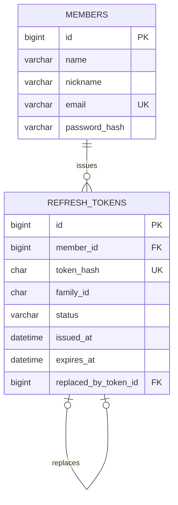

# 현재 데이터 모델

> 상태: 일부 구현

현재 회원과 인증 토큰 관리를 위해 `members`, `refresh_tokens` 테이블을 구현했습니다. 건강활동 데이터 테이블과 일·월 집계 테이블은 아직 구현하지 않았습니다.

## members

| 컬럼 | 타입 | 제약조건 | 설명 |
| --- | --- | --- | --- |
| `id` | `BIGINT` | PK, 자동 생성 | 내부 회원 식별자 |
| `name` | `VARCHAR(100)` | NOT NULL | 회원 이름 |
| `nickname` | `VARCHAR(30)` | NOT NULL | 서비스 표시 이름 |
| `email` | `VARCHAR(254)` | NOT NULL, UNIQUE (`uk_members_email`) | 로그인 식별자 |
| `password_hash` | `VARCHAR(60)` | NOT NULL | BCrypt 해시 |

이메일 유니크 제약조건은 애플리케이션의 사전 중복 검사와 별개로 동시 요청의 중복 저장을 막습니다. 실제 MySQL 호환성 테스트로 `uk_members_email` 제약조건 예외 형식도 검증합니다.

## refresh_tokens

| 컬럼 | 타입 | 제약조건 | 설명 |
| --- | --- | --- | --- |
| `id` | `BIGINT` | PK, 자동 생성 | 내부 토큰 식별자 |
| `member_id` | `BIGINT` | NOT NULL, FK | 토큰 소유 회원 |
| `token_hash` | `CHAR(64)` | NOT NULL, UNIQUE (`uk_refresh_tokens_token_hash`) | Refresh Token의 SHA-256 해시 |
| `family_id` | `CHAR(36)` | NOT NULL | 로그인·회전으로 이어지는 토큰 계열 식별자 |
| `status` | `VARCHAR(10)` | NOT NULL | `ACTIVE`, `ROTATED`, `REVOKED` 상태 |
| `issued_at` | `DATETIME(6)` | NOT NULL | 발급·회전 시각 |
| `expires_at` | `DATETIME(6)` | NOT NULL | 발급·회전 시점부터 14일 후 만료 시각 |
| `replaced_by_token_id` | `BIGINT` | FK, NULL 허용 | 회전으로 발급된 후속 토큰 |

원문 Refresh Token은 저장하지 않습니다. 이전 토큰을 삭제하지 않고 회전 이력을 남겨 재사용을 감지하며, 재사용이 감지되면 같은 계열의 활성 토큰을 폐기합니다.

`idx_refresh_tokens_member_status`, `idx_refresh_tokens_family_status`, `idx_refresh_tokens_status_expires_at` 인덱스는 회원별 활성 토큰 조회, 계열 폐기, 만료 토큰 정리에 사용합니다.

## 미구현 범위

- 건강활동 원본 이벤트와 `recordkey` 연결 모델
- 일별·월별 활동 집계 모델
- 회원과 건강활동 데이터의 관계

건강활동 기능의 입력 정규화·중복 수집·권한 정책은 [건강활동 데이터 기능 명세](features/activity-data.md)에 설계 예정 범위로 정리했습니다. 활동 테이블을 Flyway 마이그레이션으로 구현한 뒤 이 문서를 실제 스키마로 확장합니다.
