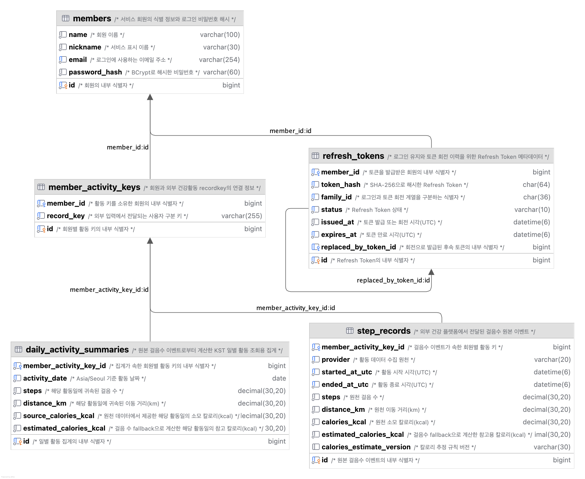
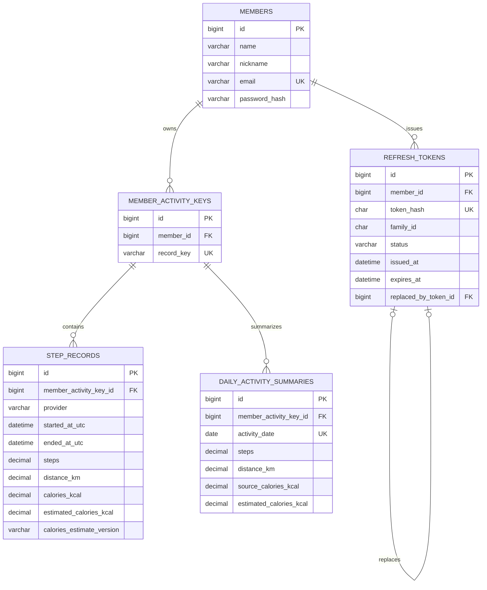

# 현재 데이터 모델

> 상태: 구현 완료

회원·인증 토큰·걸음수 원본 이벤트와 KST 일별 활동 집계를 위한 `members`, `refresh_tokens`, `member_activity_keys`, `step_records`, `daily_activity_summaries` 테이블을 구현했습니다. 원본 이벤트는 복구·재집계의 기준으로 보관하고, 일별 집계는 조회용 파생 데이터로 사용합니다.

## ERD

아래 이미지는 Flyway V08까지 적용한 MySQL 스키마를 DataGrip에서 생성한 ERD입니다. 이미지에는 테이블·컬럼·타입·FK 관계와 컬럼 주석을 표시합니다. 스키마의 정본은 Flyway SQL이며, 이 문서의 Mermaid ERD와 제약조건 표는 이미지에서 한눈에 드러나지 않는 복합 제약조건을 함께 설명합니다.

### 다이어그램 표기 보완

DataGrip 이미지의 PK·FK 아이콘과 관계선 외에, 다음 제약조건과 상태값은 문서로 명시한다.

| 구분 | 대상 | 의미 |
| --- | --- | --- |
| UNIQUE | `members.email` | 같은 이메일의 중복 회원가입을 막는다. |
| UNIQUE | `refresh_tokens.token_hash` | 같은 Refresh Token 해시를 한 번만 저장한다. |
| UNIQUE | `member_activity_keys.record_key` | 하나의 외부 `recordkey`를 한 회원에게만 연결한다. |
| 복합 UNIQUE | `step_records(member_activity_key_id, provider, started_at_utc, ended_at_utc)` | 같은 활동 키·원천·기간의 원본 이벤트 재전송을 식별한다. |
| 복합 UNIQUE | `daily_activity_summaries(member_activity_key_id, activity_date)` | 활동 키와 KST 활동일 조합마다 일별 집계 행을 하나만 둔다. |
| 보조 인덱스 | `refresh_tokens`의 회원·계열·상태/만료 인덱스 | 활성 토큰 조회, 계열 폐기, 만료 토큰 처리를 지원한다. |
| 보조 인덱스 | `member_activity_keys.member_id`, `step_records(member_activity_key_id, started_at_utc)` | 회원 소유권 확인과 활동 기간 조회를 지원한다. |

`refresh_tokens.status`의 허용 상태(`ACTIVE`, `ROTATED`, `REVOKED`)와 `step_records.provider`의 내부 원천 값(`SAMSUNG_HEALTH`, `APPLE_HEALTH`, `HEALTH_CONNECT`)은 DB `CHECK` 제약조건이 아니라 애플리케이션 enum과 입력 정규화 규칙으로 관리한다. DB는 관계·유일성·조회 성능을 위한 PK·FK·UNIQUE·인덱스를 보장한다.

## members

| 컬럼 | 타입 | 제약조건 | 설명 |
| --- | --- | --- | --- |
| `id` | `BIGINT` | PK, 자동 생성 | 내부 회원 식별자 |
| `name` | `VARCHAR(100)` | NOT NULL | 회원 이름 |
| `nickname` | `VARCHAR(30)` | NOT NULL | 서비스 표시 이름 |
| `email` | `VARCHAR(254)` | NOT NULL, UNIQUE (`uk_members_email`) | 로그인 식별자 |
| `password_hash` | `VARCHAR(60)` | NOT NULL | BCrypt 해시 |

이메일 유니크 제약조건은 애플리케이션의 사전 중복 검사와 별개로 동시 요청의 중복 저장을 막습니다. 실제 MySQL 호환성 테스트로 `uk_members_email` 제약조건 예외 형식도 검증합니다.

## refresh_tokens

| 컬럼 | 타입 | 제약조건 | 설명 |
| --- | --- | --- | --- |
| `id` | `BIGINT` | PK, 자동 생성 | 내부 토큰 식별자 |
| `member_id` | `BIGINT` | NOT NULL, FK | 토큰 소유 회원 |
| `token_hash` | `CHAR(64)` | NOT NULL, UNIQUE (`uk_refresh_tokens_token_hash`) | Refresh Token의 SHA-256 해시 |
| `family_id` | `CHAR(36)` | NOT NULL | 로그인·회전으로 이어지는 토큰 계열 식별자 |
| `status` | `VARCHAR(10)` | NOT NULL | `RefreshTokenStatus` enum으로 관리하는 토큰 상태 |
| `issued_at` | `DATETIME(6)` | NOT NULL | 발급·회전 시각 |
| `expires_at` | `DATETIME(6)` | NOT NULL | 발급·회전 시점부터 14일 후 만료 시각 |
| `replaced_by_token_id` | `BIGINT` | FK, NULL 허용 | 회전으로 발급된 후속 토큰 |

원문 Refresh Token은 저장하지 않습니다. 이전 토큰을 삭제하지 않고 회전 이력을 남겨 재사용을 감지하며, 재사용이 감지되면 같은 계열의 활성 토큰을 폐기합니다.

상태 전이는 애플리케이션의 `RefreshTokenStatus` enum과 서비스 규칙으로 관리합니다. DB에는 PK·FK·UNIQUE·인덱스만 두며, 상태값의 `CHECK` 제약조건은 두지 않습니다.

`idx_refresh_tokens_member_status`, `idx_refresh_tokens_family_status`, `idx_refresh_tokens_status_expires_at` 인덱스는 회원별 활성 토큰 조회, 계열 폐기, 만료 토큰 정리에 사용합니다.

## member_activity_keys

`recordkey`와 인증된 회원의 연결을 관리합니다. `recordkey`는 provider의 일부로 취급하지 않으며, provider는 개별 활동 이벤트에 보존합니다.

| 컬럼 | 타입 | 제약조건 | 설명 |
| --- | --- | --- | --- |
| `id` | `BIGINT` | PK, 자동 생성 | 내부 활동 주체 식별자 |
| `member_id` | `BIGINT` | NOT NULL, FK | 활동 주체를 소유한 회원 |
| `record_key` | `VARCHAR(255)` | NOT NULL, UNIQUE (`uk_member_activity_keys_record_key`) | 과제 입력의 사용자 구분 키 |

`record_key` 유니크 제약조건은 한 키가 하나의 회원에게만 연결되도록 보장합니다. `idx_member_activity_keys_member_id` 인덱스는 인증 회원이 소유한 활동 키를 찾는 데 사용합니다.

## step_records

원천에서 전달한 걸음 수 구간을 변경 없이 저장합니다. 시간은 UTC 규약의 `DATETIME(6)`이며, 수치는 원본 소수점을 보존하기 위해 `DECIMAL(30,20)`을 사용합니다.

| 컬럼 | 타입 | 제약조건 | 설명 |
| --- | --- | --- | --- |
| `id` | `BIGINT` | PK, 자동 생성 | 내부 걸음수 이벤트 식별자 |
| `member_activity_key_id` | `BIGINT` | NOT NULL, FK | 회원별 활동 키 |
| `provider` | `VARCHAR(20)` | NOT NULL | `SAMSUNG_HEALTH`, `APPLE_HEALTH`, `HEALTH_CONNECT` 원천 |
| `started_at_utc` | `DATETIME(6)` | NOT NULL | 활동 시작 시점(UTC) |
| `ended_at_utc` | `DATETIME(6)` | NOT NULL | 활동 종료 시점(UTC) |
| `steps` | `DECIMAL(30,20)` | NOT NULL | 원천 걸음 수 |
| `distance_km` | `DECIMAL(30,20)` | NOT NULL | 원천 거리(km) |
| `calories_kcal` | `DECIMAL(30,20)` | NOT NULL | 원천 칼로리(kcal) |
| `estimated_calories_kcal` | `DECIMAL(30,20)` | NOT NULL | 원천 칼로리 부재 시 저장한 참고용 추정 칼로리(kcal) |
| `calories_estimate_version` | `VARCHAR(30)` | NULL | 추정값을 저장한 경우의 계산 규칙 버전 |

`uk_step_records_key_provider_period` 유니크 제약조건은 회원별 활동 키·provider·시작·종료 시각이 같은 원본 이벤트의 중복 저장을 막습니다. 업로드 서비스는 MySQL `INSERT IGNORE`로 충돌을 오류 없이 무시해 최초 원본을 유지합니다.

`idx_step_records_key_started_at_utc` 인덱스는 회원별 활동 키의 기간 조회와 일·월 집계에 사용합니다.

## daily_activity_summaries

`daily_activity_summaries`는 원본 이벤트의 `Asia/Seoul`(KST) 기준 일별 기여값을 저장하는 조회용 파생 테이블입니다. 원본 이벤트는 그대로 보관하므로, 집계 규칙 변경이나 복구가 필요할 때 원본을 기준으로 다시 만들 수 있습니다.

| 컬럼 | 타입 | 제약조건 | 설명 |
| --- | --- | --- | --- |
| `id` | `BIGINT` | PK, 자동 생성 | 내부 일별 집계 식별자 |
| `member_activity_key_id` | `BIGINT` | NOT NULL, FK | 집계가 속한 회원별 활동 키 |
| `activity_date` | `DATE` | NOT NULL | `Asia/Seoul` 기준 활동 날짜 |
| `steps` | `DECIMAL(30,20)` | NOT NULL | 해당 활동일에 귀속된 걸음 수 |
| `distance_km` | `DECIMAL(30,20)` | NOT NULL | 해당 활동일에 귀속된 이동 거리(km) |
| `source_calories_kcal` | `DECIMAL(30,20)` | NOT NULL | 원천 데이터가 제공한 소모 칼로리(kcal) |
| `estimated_calories_kcal` | `DECIMAL(30,20)` | NOT NULL | 걸음수 기반 참고 추정 칼로리(kcal) |

API의 업무 조회 조건은 외부 `record_key`입니다. 서비스는 인증·소유권 검증 뒤 `member_activity_keys`에서 해당 키의 내부 식별자를 얻고, 그 `member_activity_key_id`로 이 테이블을 조회합니다. `record_key`는 이미 유일한 연결 테이블에 보관하므로 집계 테이블에 문자열을 중복 저장하지 않습니다.

`uk_daily_activity_summaries_key_date` 유니크 제약조건은 하나의 활동 키와 `Asia/Seoul` 활동 날짜 조합에 하나의 집계 행만 두도록 보장합니다. 이 유니크 인덱스는 활동 키별 날짜 범위 조회에도 사용합니다. 시간대는 현재 서비스 정책으로 고정되어 있어 별도 컬럼으로 저장하지 않습니다.

업로드 서비스는 원본 이벤트 저장 결과 중 실제로 새로 저장된 항목만 KST 일별 기여값으로 나눈 뒤, 같은 트랜잭션에서 이 테이블에 반영합니다. 날짜별 갱신은 MySQL `INSERT ... ON DUPLICATE KEY UPDATE`로 원자적으로 더하므로, 같은 활동 키·날짜를 동시에 갱신해도 한 행에 합산됩니다. 집계 반영에 실패하면 원본 이벤트와 활동 키 생성도 함께 rollback됩니다.

Daily 조회 API는 요청 범위의 일별 집계 행을 읽고, 행이 없는 날짜는 `0`값으로 채웁니다. Monthly 조회 API는 같은 일별 집계 행을 `Asia/Seoul` 기준 월로 합산합니다. 따라서 공개 조회 경로는 원본 이벤트 전체를 읽지 않고 요청 범위의 일별 집계 행만 읽습니다.

## 영속성 접근 원칙

회원, 활동 키, 원본 이벤트, 일별 집계와 같은 일반적인 도메인 영속성·조회에는 Spring Data JPA와 JPA 엔티티를 사용합니다. 원본 활동 이벤트의 멱등 batch 저장만은 MySQL `INSERT IGNORE`의 항목별 신규·중복 결과가 필요하므로 JDBC prepared batch를 사용합니다. 이 결과가 없으면 중복 원본 이벤트를 이후 일별 집계에 다시 반영할 위험이 있기 때문입니다.

건강활동 기능의 입력 정규화·중복 수집·권한 정책은 [건강활동 데이터 기능 명세](features/activity-data.md)에 정리했습니다.
